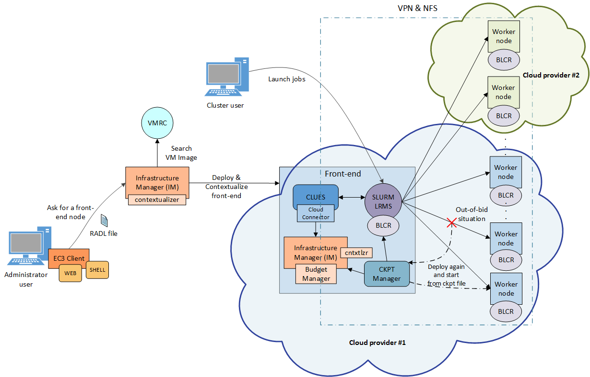
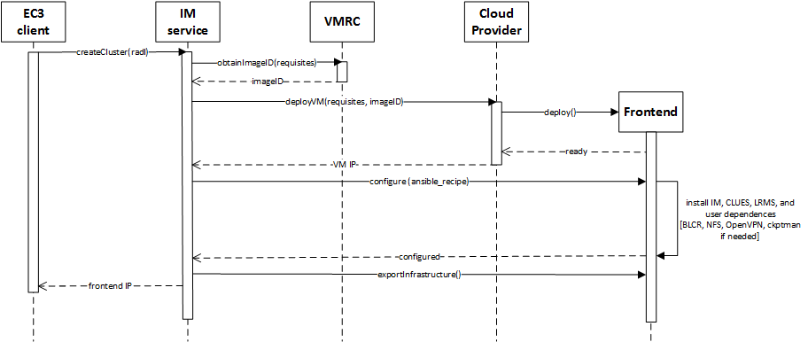
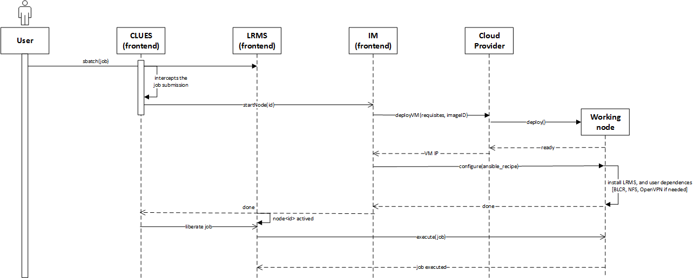

Architecture
============

Overview
--------

EC3 proposes the combination of Green computing, Cloud computing and HPC techniques to 
create a tool that deploys elastic virtual clusters on top of IaaS Clouds. EC3 creates 
elastic cluster-like infrastructures that automatically scale out to a larger number of 
nodes on demand up to a maximum size specified by the user. Whenever idle resources are 
detected, the cluster dynamically and automatically scales in, according to some predefined 
policies, in order to cut down the costs in the case of using a public Cloud provider. 
This creates the illusion of a real cluster without requiring an investment beyond the 
actual usage. Therefore, this approach aims at delivering cost-effective elastic Cluster 
as a Service on top of an IaaS Cloud.

General Architecture
--------------------

:ref:`Fig. 1 <figure_arch>` summarizes the main architecture of EC3. The deployment of the virtual 
elastic cluster consists of two phases. The first one involves starting a VM in the Cloud to act as 
the cluster front-end while the second one involves the automatic management of the cluster size, 
depending on the workload and the specified policies. For the first step, a launcher (EC3 Launcher) 
has been developed that deploys the front-end on the Cloud using the infrastructure deployment services 
described in Section 3.1. The sysadmin will run this tool, providing it with the following information:

.. _figure_arch:

   Fig 1. EC3 Architecture.

* Maximum cluster size. This serves to establish a cost limit in case of a workload peak. The 
  maximum cluster size can be modified at any time once the virtual cluster is operating. Thus, 
  the sysadmins can adapt the maximum cluster size to the dynamic requirements of their users. 
  In this case the LRMS must be reconfigured to add the new set of virtual nodes and in some cases 
  it may imply a LRMS service restart.
* :ref:`RADL <RADL>` document specifying the desired features of the cluster front-end, regarding both hardware and 
  software (OS, LRMS, additional libraries, etc.). These requirements are taken by the launcher and 
  extended to include additional ones (such as installing CLUES and its requirements together with the 
  libraries employed to interact with the IaaS Cloud provider, etc.) in order to manage elasticity.

The launcher starts an IM that becomes responsible of deploying the cluster front-end. This is done by 
means of the following steps:

#. Selecting the VMI for the front-end. The IM can take a particular user-specified VMI, or it can 
   contact the `VMRC <http://www.grycap.upv.es/vmrc>`_ to choose the most appropriate VMI available, 
   considering the requirements specified in the RADL.
#. Choosing the Cloud deployment according to the specification of the user (if there are different providers).
#. Submitting an instance of the corresponding VMI and, once it is available, installing and configuring all 
   the required software that is not already preinstalled in the VM

One of the main LRMS configuration steps is to set up the names of the cluster nodes. This is done using a 
sysadmin-specified name pattern (e.g. vnode-*) so that the LRMS considers a set of nodes such as vnode-1, 
vnode-2, ... , vnode-n, where n is the maximum cluster size. This procedure results in a fully operational 
elastic cluster. :ref:`Fig. 2 <figure_deployment>` represents the sequence diagram and the interaction of the main components and actors during the deployment of the frontend of the cluster using EC3. 

.. _figure_deployment:

   Fig 2. Sequence diagram for the deployment of the frontend.

Once the front-end and the elasticity manager (CLUES) have been deployed, the virtual cluster becomes 
totally autonomous and every user will be able to submit jobs to the LRMS, either from the cluster 
front-end or from an external node that provides job submission capabilities. The user will have the 
perception of a cluster with the number of nodes specified as maximum size. CLUES will monitor the working 
nodes and intercept the job submissions before they arrive to the LRMS, enabling the system to dynamically
manage the cluster size transparently to the LRMS and the user, scaling in and out on demand.

Just like in the deployment of the front-end, CLUES internally uses an IM to submit the VMs that will be 
used as working nodes for the cluster. For that, it uses a RADL document defined by the sysadmin, where 
the features of the working nodes are specified. Once these nodes are available, they are automatically 
integrated in the cluster as new available nodes for the LRMS. Thus, the process to deploy the working nodes 
is similar to the one employed to deploy the front-end.

:ref:`Fig. 3 <figure_jobs>` represents the sequence diagram and the interaction when a new job arrives to the LRMS and no nodes are available for the execution of the job. 

.. _figure_jobs:

   Fig 3. Sequence diagram that represents when a new job arrives to the cluster.

Note that the EC3-L tool can be executed on any machine that has a connection with the Cloud system and 
it is only employed to bootstrap the cluster. Once deployed, the cluster becomes autonomous and self-managed, 
and the machine from which the EC3-L tool was used (the dashed rectangle in Fig. 1) is no longer required. 
The expansion of the cluster while it is operating is carried out by the front-end node, by means of CLUES, as explained above.

Infrastructure Manager
----------------------

The `Infrastructure Manager (IM) <http://www.grycap.upv.es/im>`_ is a tool that eases the access and the usability of IaaS clouds by automating 
the VMI selection, deployment, configuration, software installation, monitoring and update of Virtual Appliances. 
It supports APIs from a large number of virtual platforms, making user applications cloud-agnostic. In addition 
it integrates a contextualization system to enable the installation and configuration of all the user required 
applications providing the user with a fully functional infrastructure.

.. _RADL:

RADL
----

The main purpose of the `Resource and Application description Language (RADL) <http://www.grycap.upv.es/im/doc/radl.html>`_ 
is to specify the requirements of the resources where the scientific applications will be executed. 
It must address not only hardware (CPU number, CPU architecture, RAM size, etc.) but also software requirements (applications, libraries, data base systems, etc.).
It should include all the configuration details needed to get a fully functional and configured VM (a Virtual 
Appliance or VA). It merges the definitions of specifications, such as OVF, but using a declarative scheme, with 
contextualization languages such as Ansible. It also allows describing the underlying network capabilities required.

CLUES
-----

`CLUES <http://www.grycap.upv.es/clues>`_ is an energy management system for High Performance Computing (HPC) Clusters and Cloud infrastructures. 
The main function of the system is to power off internal cluster nodes when they are not being used, and conversely 
to power them on when they are needed. CLUES system integrates with the cluster management middleware, such as a 
batch-queuing system or a cloud infrastructure management system, by means of different connectors.
