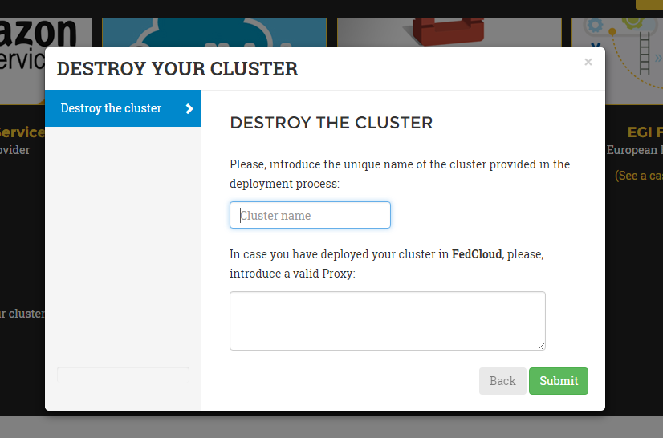

Web Interface
=============

Overview
--------

EC3 as a Service (EC3aaS), is a web service offered to the community to facilitate
the usage of EC3 to non-experienced users. Anyone can access the website and
try the tool by using the user-friendly wizard to easily configure and deploy Virtual
Elastic Clusters on multiple Clouds. The service does not require any account to
use it. The user only needs to choose the Cloud provider and provide its credentials
to allow EC3 to provision VMs from the underlying Clouds on behalf of the user.

Configuration and Deployment of a Cluster
-----------------------------------------

In order to configure and deploy a Virtual Elastic Cluster using EC3aaS, a user
accesses the homepage and selects "Deploy your cluster!" (:ref:`Fig. 1 <figure_home>`). With this
action, the web page will show different Cloud providers supported by the web
interface version of EC3. Notice that not all the Cloud providers supported by EC3
appear in the website, only the most important providers in the field of research are
currently supported by the web version. Users that want to use another supported
Cloud provider, such as Microsoft Azure or Google Cloud Engine, are encouraged
to use the CLI interface.

.. _figure_home:
.. figure:: images/home.png

   Fig 1. EC3aaS homepage.

The first step, then, is to choose the Cloud provider where the cluster will be
deployed (:ref:`Fig. 2 <figure_providers>`). 

.. _figure_providers:
.. figure:: images/providers.png

   Fig 2. Deploy and Manage section of the website.

When the user chooses the deployment of a new infrastructure, a wizard pops up (:ref:`Fig. 3 <figure_wizard>`).
This wizard will guide the user during the configuration process of the cluster,
allowing to configure details like the operating system, the characteristics of the
nodes, the maximum number of nodes of the cluster or the pre-installed software
packages. 

.. _figure_wizard:
.. figure:: images/wizard.png

   Fig 3. Wizard to configure and deploy a virtual cluster in Fogbow.

Specifically, the wizard steps are:

#. **Cluster Type**: the user first selects the type of cluster he/she wants to deploy.
   Currently, there are two different options: Kubernetes + Jupyter Notebook or Mesos + Spark + Lemonade.
   Moreover, on the bottom of this step, there is an option to indicate the github URL where deployments of
   the user apps are. This only works together with the Kubernetes option.
#. **Provider account**: Valid user credentials are required to access to the
   resources of Fogbow. The wizard then is able to contact with Fogbow to generate the token by using the user credentials.
#. **Operating System**: the user can choose the OS of the cluster, by using a
   select box where the available images of Fogbow for its credentials are listed. 
   It takes some seconds to appear, because a call to the Fogbow's API is performed.
#. **Instance details**: the user must indicate the instance details, like the number
   of CPUs or the RAM memory, for the front-end and also the working
   nodes of the cluster. 
#. **Cluster's size & Name**: the user can introduce the maximum number of nodes of
   the cluster, without including the front-end node. This value indicates the
   maximum number of working nodes that the cluster can scale. Remember that, initially
   the cluster only is created with the front-end, and the nodes are powered on on-demand.
   Also, a unique name is required by the user for the cluster.
#. **Resume and Launch**: a summary of the chosen configuration of the cluster
   is showed to the user at the last step of the wizard, and the deployment
   process can start by clicking the Submit button.

Finally, when all the steps of the wizard are filled correctly, the submit button
starts the deployment process of the cluster. Only the front-end will be deployed,
because the working nodes will be automatically provisioned by EC3 when the
workload of the cluster requires them. When the virtual machine of the front-end
is running, EC3aaS provides the user with the necessary data to connect to the
cluster (:ref:`Fig. 4 <figure_data>`) which is composed by the username and password to connect
to the cluster, the front-end IP and the name of the cluster. The user must keep
this data during the lifetime of the cluster, since it is used also to terminate it.
The cluster may not be configured when the IP of the front-end is returned by the
web page, because the process of configuring the cluster is a batch process that
takes several minutes, depending on the chosen configuration. However, the user
is allowed to log in the front-end machine of the cluster since the moment it is
deployed. To know if the cluster is configured, the command is_cluster_ready can
be used. It will check if the configuration process of cluster has finished::

  ubuntu@kubeserverpublic:~$ is_cluster_ready
  Cluster configured!

.. _figure_data:
.. figure:: images/data.png

   Fig 4. Information received by the user when a deployment succeeds.

Notice that EC3aaS does not offer all the capabilities of EC3, like hybrid clusters
or heterogeneous nodes. Those capabilities are considered advanced aspects
of the tool and are only available via the `EC3 Command-line Interface`_.

Termination of a Cluster
------------------------

To delete a cluster the user only needs to access the EC3aaS webpage, and click on
the "Delete your cluster" button. He/she must indicate in the wizard (:ref:`Fig. 5 <figure_delete>`) the cluster name provided
in the deployment phase and the Fogbow credentials again, to generate the token in order to destroy the resources. 
The cluster name is a string composed by the name given to the cluster in the deployment process 
followed by a random string of five characters (including numbers and letters). 
This cluster name is unique and allows EC3 to identify the cluster of the user without using an user account. 

When the process finishes successfully, the front-end of the cluster and all the
working nodes had been destroyed and a message is shown to the user informing
the success of the operation. If an error occurs during the deleting process (for
example, the indicated cluster name does not exist), an error message is returned
to the user.

.. _figure_delete:

   Fig 5. Wizard to delete a cluster.

Additional information
----------------------

You can find interesting reading also:
* `EC3 Command-line Interface`_.
* `EC3 Architecture`_.
* `FAQs`_.

.. _`EC3 Command-line Interface`: http://ec3.readthedocs.org/en/atmosphere/ec3.html
.. _`EC3 Architecture`: https://ec3.readthedocs.io/en/atmosphere/arch.html
.. _`FAQs`: https://ec3.readthedocs.io/en/atmosphere/faq.html
