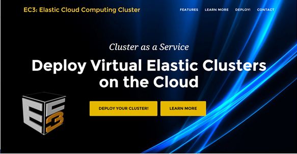
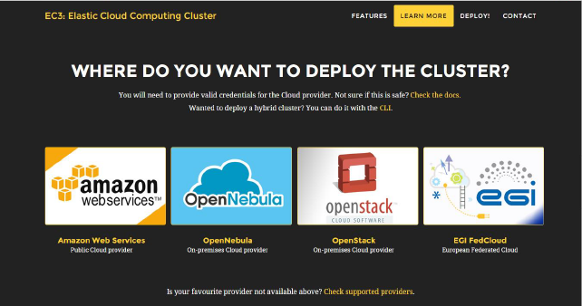
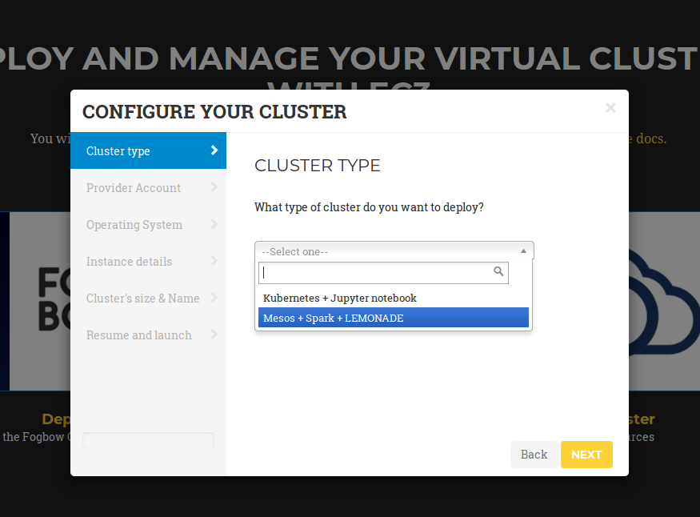
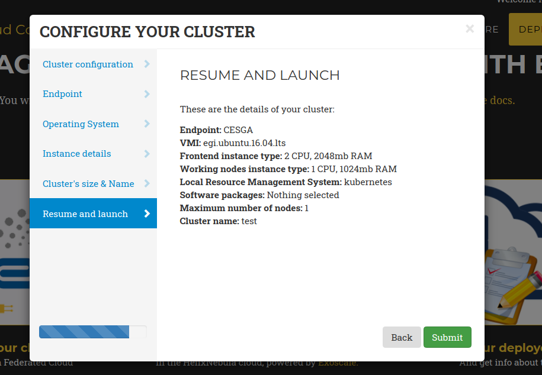
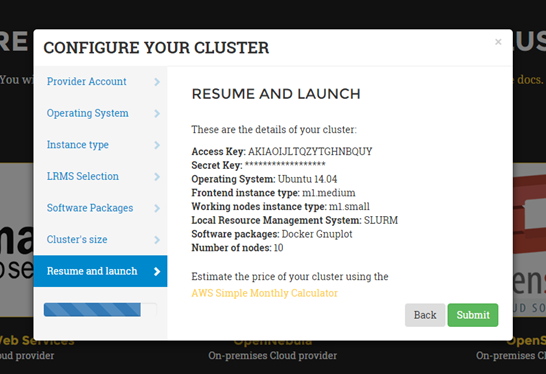
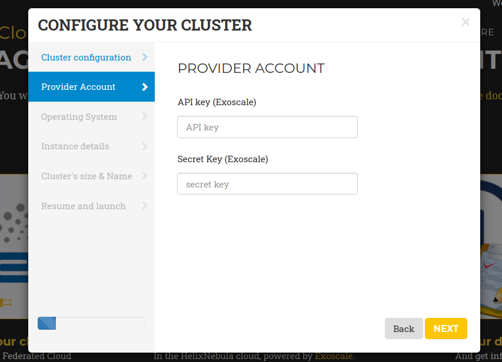
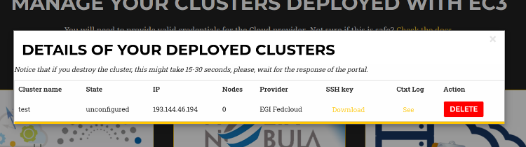

Web Interface
=============

Overview
--------

EC3 as a Service (EC3aaS), is a web service offered to the community to facilitate
the usage of EC3 to non-experienced users. The EC3 portal integrated in the
`EGI Application on Demmand`_ can be accessed by users of the `vo.access.egi.eu` VO
(read `EGI AoD documentation`_ to get more information). The users are enabled to
try the tool by using the user-friendly wizard to easily configure and deploy Virtual
Elastic Clusters on `EGI Cloud Compute`_ or `HelixNebula`_ Cloud (powered by `Exoscale`_) resources.
The user only needs to choose the Cloud provider and allow EC3 to provision VMs on behalf
of the user.

Initial Steps
-------------

The first step to access the EC3 portal is to autenticate with your `EGI CheckIn`_
credentials. Once logged you will see on the rigth-top corner the obtained full name.
These credentials will be used to interact with EGI Cloud Compute providers.
Then the user, in order to configure and deploy a Virtual Elastic Cluster using EC3aaS, 
accesses the homepage and selects "Deploy your cluster!" (:ref:`Fig. 1 <figure_home>`).
With this action, the web page will show different Cloud providers supported by the AoD web
interface version of EC3: EGI Cloud Compute or HelxNebula Cloud.

.. _figure_home:

   Fig 1. EC3aaS homepage.

The next step, then, is to choose the Cloud provider where the cluster will be
deployed (:ref:`Fig. 2 <figure_providers>`).

.. _figure_providers:

   Fig 2. List of Cloud providers supported by EC3aaS.

Configuration and Deployment of a Cluster in EGI Cloud Compute
--------------------------------------------------------------

When the user chooses the EGI Cloud Compute provider a wizard pops up
(:ref:`Fig. 3 <figure_wizard>`). This wizard will guide the user during the
configuration process of the cluster, allowing the selection of the Cloud site where
the VMs will be deployed, the operating system, the type of LRMS system to use,
the characteristics of the nodes, the maximum number of cluster nodes or
the software packages to be installed.

.. _figure_wizard:

   Fig 3. Wizard to configure and deploy a virtual cluster in EGI Cloud Compute.

Specifically, the wizard steps are:

#. **Cluster Configuration**: the user can choose the Local Resource Management
   System preferred to be automatically installed and configured by EC3. Currently,
   SLURM, Torque, Grid Engine, Mesos (+ Marathon + Chronos), Kubernetes, `ECAS`_,
   Nomad and `OSCAR`_ are supported. Also a set of common software packages is
   available to be installed in the cluster, Spark, Galaxy (only in case of SLURM
   clusters), GNUPlot or Octave. EC3 will install and configure them
   automatically in the contextualization process. If the user needs another
   software to be installed in his cluster, a new Ansible recipe can be developed
   and added to EC3 by using the CLI interface.
#. **Endpoint**: the user has to choose one of the EGI Cloud Compute sites that provides
   support to the `vo.access.egi.eu` VO. The list of sites is automatically obtained
   from the `EGI AppDB`_ information system. In case that the site has some errors in the
   Argo Monitoring System a message `(CRITICAL state!)` will be added to the name.
   You can still use this site but it may fail due to this errors.
#. **Operating System**: the user chooses the OS of the cluster from the list of available
   Operating Systems that are provided by the selected Cloud site (also obtained from AppDB).
#. **Instance details**: the user must indicate the instance details, like the number
   of CPUs or the RAM memory, for the front-end and also the working
   nodes of the cluster (also obtained from AppDB).
#. **Cluster's size & Name**: here, the user has to select the maximum number of nodes of
   the cluster (from 1 to 10), without including the front-end node. This value indicates
   the maximum number of working nodes that the cluster can scale. Remember that, initially
   the cluster only is created with the front-end, and the nodes are powered on on-demand.
   Also a name for the cluster (that must be unique) is required to identify the cluster.
#. **Resume and Launch**: a summary of the chosen configuration of the cluster
   is shown to the user at the last step of the wizard, and the deployment
   process can start by clicking the Submit button (:ref:`Fig. 4 <_figure_resume>`).

.. _figure_resume:

   Fig 4. Resume and Launch: final Wizard step.

Finally, when all the steps of the wizard are fulfilled correctly, the submit button
starts the deployment process of the cluster. Only the front-end will be deployed,
because the working nodes will be automatically provisioned by EC3 when the
workload of the cluster requires them. When the virtual machine of the front-end
is running, EC3aaS provides the user with the necessary data to connect to the
cluster (:ref:`Fig. 5 <figure_data>`) which is composed by the username and SSH private
key to connect to the cluster, the front-end IP and the name of the cluster.

.. _figure_data:

   Fig 5. Information received by the user when a deployment succeeds.

The cluster may not be configured when the IP of the front-end is returned by the
web page, because the process of configuring the cluster is a batch process that
takes several minutes, depending on the chosen configuration. However, the user
is allowed to log in the front-end machine of the cluster since the moment it is
deployed. To know if the cluster is configured, the command is_cluster_ready can
be used. It will check if the configuration process of cluster has finished::

  user@local:~$ssh -i key.pem <username>@<front_ip>
  ubuntu@kubeserverpublic:~$ is_cluster_ready
  Cluster configured!

If the the command `is_cluster_ready` is not found it means that the cluster is already
being configured.

Notice that EC3aaS does not offer all the capabilities of EC3, like hybrid clusters
or the usage of spot instances. Those capabilities are considered advanced aspects
of the tool and are only available via the `EC3 Command-line Interface`_.

Configuration and Deployment of a Cluster in HelixNebula Cloud
--------------------------------------------------------------

In case of HelixNebula Cloud, the wizard is the same shown for EGI Cloud
Compute but it has an additional step after "Cluster Configuration".
In the "Provider Account" step (:ref:`Fig. 6 <figure_helix>`) the user must provide the API key 
and Secret Key of the Exoscale cloud. To get them, follow the steps described in the
`Exoscale Vouchers for AoD`_ documentation.

.. _figure_helix:

   Fig 6. Helix Nebula Provider Cccount wizard step.

Management of deployed clusters
-------------------------------

You can get a list of all your deployed clusters choosing the "Manage your deployed clusters"
option (right in :ref:`Fig. 2 <figure_providers>`). It will show a list with the details of
the clusters launched by the user. The list will show the following information: Cluster
name (specified by the user on creation), the state, front-end public IP, number of working
nodes deployed. It will also enable the user to download the SSH private key needed to access
the front-end node and the contextualization log to see all the configuration steps performed.
This log will enable the user to verify the currect status of the configuration of the cluster,
and check for errors in case that the cluster is not correctily configured (unconfigured state).
Finally it also offers a button to delete the cluster.

When the deletion process finishes successfully, the front-end of the cluster and all the
working nodes had been destroyed and a message is shown to the user informing
the success of the operation. If an error occurs during the deleting process,
an error message is returned to the user.

.. _figure_list:

   Fig 7. List of Clusters deployed by the active user.

.. _`EC3 Command-line Interface`: http://ec3.readthedocs.org/en/latest/ec3.html
.. _`OSCAR`: https://github.com/grycap/oscar
.. _`EGI Application on Demmand`: https://marketplace.egi.eu/42-applications-on-demand
.. _`EGI AoD documentation`: https://egi-federated-cloud.readthedocs.io/en/latest/aod.html
.. _`EGI CheckIn`: https://www.egi.eu/services/check-in/
.. _`EGI Cloud Compute`: https://www.egi.eu/services/cloud-compute/
.. _`HelixNebula`: https://www.helix-nebula.eu/
.. _`Exoscale`: https://www.exoscale.com/
.. _`ECAS`: https://portal.enes.org/data/data-metadata-service/processing/ecas
.. _`EGI AppDB`: https://appdb.egi.eu/
.. _`Exoscale Vouchers for AoD`: https://egi-federated-cloud.readthedocs.io/en/latest/aod/exoscale-vouchers.html
