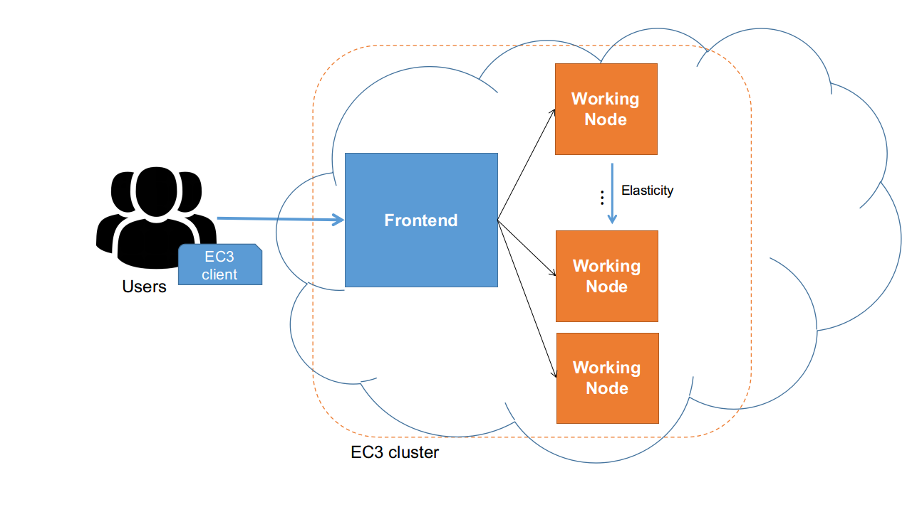
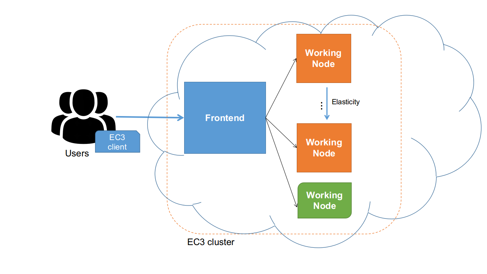
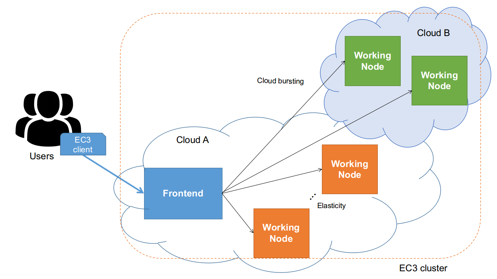

.. _models:

Deployment Models
=================

EC3 supports a wide variety of deployment models (i.e. cluster behaviour). 
In this section, we provide information about all of them and a example of configuration for each deployment model.
For more details, you can follow reading `ec3_variables`_, which provides more information regarding EC3 special
variables that support the specification of the deployment model in the templates.

Basic structure (homogeneous cluster)
-------------------------------------

An homogeneous cluster is composed by working nodes that have the same characteristics (hardware and software).
This is the basic deployment model of EC3, where we only have one type of ``system`` for the working nodes.

.. _figure_basic:

   Fig 1. EC3 Deployment Model for an homogeneous cluster.

In EC3, a template specifying this model would be, for instance::

   system wn (
      ec3_max_instances = 6 and
	  ec3_node_type = 'wn' and
      cpu.count = 4 and
      memory.size >= 2048M and
	  disk.0.os.name = 'linux' and
      net_interface.0.connection = 'net'
   )

This RADL defines a *system* with the feature ``cpu.count`` equal to four, the feature
``memory.size`` greater or equal than ``2048M`` , a operative system based on ``linux`` 
and with the feature ``net_interface.0.connection`` bounded to ``'net'``.
It also fixes the maximum number of working nodes to ``6`` with the EC3 special variable 
``ec3_max_instances``, and indicates that this *system* is of type ``wn`` though ``ec3_node_type``.

Heterogeneous cluster
---------------------
This model allows that the working nodes comprising the cluster can be of 
different characteristics (hardware and software). 
This is of special interest when you need nodes with different configuration or 
hardware specifications but all working together in the same cluster.
It also allows you to configure several queues and specify from which queue the working node belongs to.

.. _figure_hetero:

   Fig 2. EC3 Deployment Model for an heterogeneous cluster.
   
In EC3, a template specifying this model would be, for instance::

   system wn (
      ec3_max_instances = 6 and
	  ec3_node_type = 'wn' and
	  ec3_node_queues_list = 'smalljobs' and
	  ec3_node_pattern = 'wn[1,2,3]' and 
      cpu.count = 4 and
      memory.size >= 2048M and
	  disk.0.os.name = 'linux' and
      net_interface.0.connection = 'net'
   )
   
   system largewn (
      ec3_inherit_from = system wn and
	  ec3_node_queues_list = 'largejobs' and
	  ec3_node_pattern = 'wn[4,5,6]' and
      cpu.count = 8 and
      memory.size >= 4096M
   )

This RADL defines two different *system*. The first one defines the ``wn`` with the feature ``cpu.count`` 
equal to four, the feature ``memory.size`` greater or equal than ``2048M`` , and with the feature
``net_interface.0.connection`` bounded to ``'net'``. 
Again, it also fixes the maximum number of working nodes to ``6`` with the EC3 special variable 
``ec3_max_instances``, and indicates that this *system* is of type ``wn`` though ``ec3_node_type``.
More systems can be defined, it is not limited to two types of working nodes, it's only an example.
The second defined *system*, called ``largewn``, inherits the already defined characteristics of ``system wn``,
by using the EC3 special feature ``ec3_inherit_from``, but it changes the values for ``cpu.count`` and ``memory.size``.
Regarding queue management, the RADL defines two queues by using ``ec3_node_queues_list``, and determines whose 
nodes belong to them. It is also defined the pattern to construct the name of the nodes by the ``ec3_node_pattern`` variable.

Cloud Bursting (Hybrid clusters)
--------------------------------
The third model supported by EC3 is Cloud Bursting. It consists on launching nodes in two or more different Cloud providers.
This is done to manage user quotas or saturated resources. When a limit is reached and no more nodes can be deployed inside the
first Cloud Provider, EC3 will launch new nodes in the second defined Cloud provider. This is also called a hybrid cluster.
The nodes deployed in different Cloud providers can be different also, so heterogeneous clusters with cloud bursting 
capabilities can be deployed and automatically managed with EC3. The nodes would be automatically interconnected by using
VPN or SSH tunneling techniques.

.. _figure_hybrid:

   Fig 3. EC3 Deployment Model for an hybrid cluster.
   
In EC3, a template specifying this model would be, for instance::

	system wn (
		disk.0.os.name = 'linux' and
		disk.0.image.url = 'one://mymachine.es/1' and 
		disk.0.os.credentials.username = 'ubuntu' and
		ec3_max_instances = 6 and               # maximum instances of this kind
	    cpu.count = 4 and
        memory.size >= 2048M and
		ec3_if_fail = 'wn_aws'
	)

	system wn_aws (
		ec3_inherit_from = system wn and        # Copy features from system 'wn'
		disk.0.image.url = 'aws://us-east-1/ami-30519058' and # Ubuntu 14.04
		disk.0.os.credentials.username = 'ubuntu' and
		ec3_max_instances = 8 and               # maximum instances of this kind
		ec3_if_fail = ''
	)

This RADL is similar to the upper ones. It also defines two different *system*, but the important detail here is
the EC3 variable ``ec3_if_fail``. It defines the next *system* type to be used when no more instances of *system wn* can be launched.

.. _`ec3_variables`: http://ec3.readthedocs.io/en/devel/templates.html#special-ec3-features 

